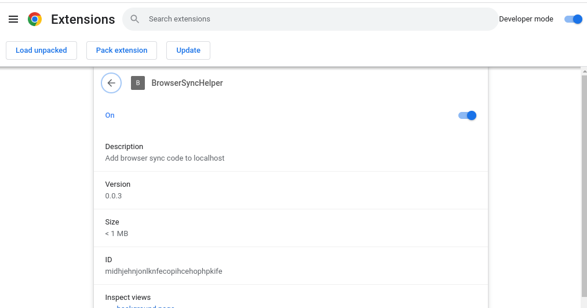

# BrowserSync

## Install

Turn on developer mode and load the extension by clcking the **Load unpacked**
extension button.



Set up an alias in your bashrc file. Below is what I use in mine. Then I can cd
into the directory I'm working and run the command to start the browser-sync
server.

```bash
alias bss="browser-sync start --ignore 'node_modules/*' --ignore 'vendor/*' --ignore='storage/*' -w -f '**/*.*'"
```
